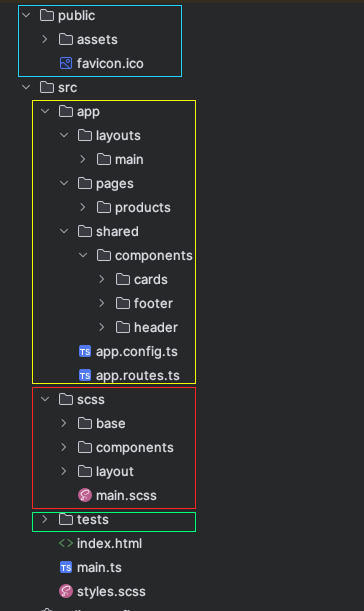

# Front-End Application (Challenge)
- Por Edwin Castañeda [winedcasta@hotmail.com](mailto:winedcasta@hotmail.com)
- Para: Chicks Gold
- Fecha: Sábado 2 de agosto de 2025

## Información de las herramientas

- Framework: Angular 20.1.3
- Node Version: 20.19.4


## Arquitectura de Carpetas



## SRC/SCSS (Sistema de diseño)
Contiene todo el sistema de diseño
### /base:
Contiene los valores globales, un reset sencillo, tipografía y archivo de variables.

### /components:
Contiene para este caso los archivos de los cards de los productos en venta y los modificadores para los inputs.

### /layout:
Contiene elementos de armado  de partes del aplicativo que podrían reutilizarse como el footer, la navigation, pagination.

#### NOTA: este es un trabajo en proceso, y el objetivo es establecer una estructura desacoplada pensada en módulos y componentes.

## SRC/APP (Codebase)

### /layout:
Contiene la sección main o wrapper para enlatar el contenido central de la aplicación.

### /pages:
Contiene las rutas, de momento la home (/) es la unica ruta, y la página que está creada es la del catálogo de productos.

### /shared:
Contiene el elemento reutilizables como el header (navigation) y el footer, adicional se separó el componente cards el cual ya funciona como un componente independiente.

#### NOTA: este es un trabajo en proceso, y el objetivo es establecer una estructura desacoplada pensada en módulos y componentes.


## SRC/TEST (Unit Testing)
Se agrupan todos los test en la carpeta test para mantener el code funcional sobre el SRC y los test agrupados para su objetivo específico.

## PUBLIC
### /assets:
Contiene todos los activos como images de producto, iconos, logos y cualquier elemento visual. Aquí se podrían colocar elementos statics públicos como fonts, xml, o json.

# ¿Cómo Ejecutar?
Descargue o clone el repositorio en una carpeta conocida.
## Local Compile

Instalar las dependencias:
Verifique antes que posee la versión adecuada de Node.js para evitar problemas. En el inicio de este documento se colocó la versión en la que fue construido.

```bash
npm install
```

Ejecutar para correr el servidor en el equipo local:

```bash
ng serve
```

Para construir la aplicación y empaquetarla para usarla en un nginx o docker:

```bash
ng build
```

Ejecución de test unitarios (se ejecutan con Karma y están escritas con Jasmine):
```bash
ng test
```
